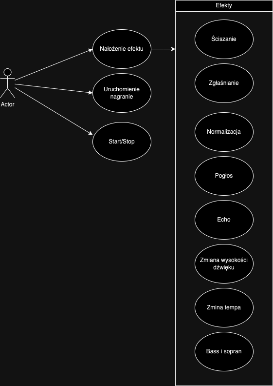

### Instrukcja uruchomienia i opis działania programu do przetwarzania dźwięku

Program składa się z trzech plików: `efekty.py`, `gui.py`, i `main.py`. Poniżej znajdziesz instrukcję krok po kroku oraz szczegóły dotyczące działania programu.

---

#### 1. **Zainstaluj wymagane biblioteki**
Program wymaga kilku bibliotek do działania. Możesz je zainstalować, uruchamiając następującą komendę:

```bash
pip install numpy librosa scipy PySimpleGUI soundfile mixer
```

#### 2. **Opis plików**
   - **`efekty.py`**: Zawiera funkcje efektów dźwiękowych, które można zastosować do plików audio. Funkcje obejmują:
     - Normalizacja
     - Dodawanie pogłosu
     - Dodawanie echa
     - Przesunięcie wysokości dźwięku (pitch shift)
     - Zmiana tempa
     - Podgłośnienie i ściszenie
     - Edycja basów i sopranów
   - **`gui.py`**: Tworzy graficzny interfejs użytkownika przy użyciu `PySimpleGUI`. Umożliwia wybór pliku audio oraz efektu, który ma zostać zastosowany. Interfejs zapewnia również możliwość ustawienia parametrów dla wybranego efektu.
   - **`main.py`**: Obsługuje ładowanie pliku audio i zastosowanie wybranego efektu przy użyciu funkcji z pliku `efekty.py`. Zapisuje przetworzony plik jako `przetworzony_plik_audio.wav`.

#### 3. **Uruchomienie programu**
Aby uruchomić aplikację z interfejsem graficznym, wykonaj w terminalu następujące polecenie:

```bash
python gui.py
```

---

### Opis działania krok po kroku:
1. **Wybór pliku audio**: Po uruchomieniu `gui.py`, pojawi się okno, w którym możesz wybrać plik audio z komputera.
2. **Wybór efektu**: Wybierz jeden z efektów (normalizacja, pogłos, echo, itp.).
3. **Ustawienie parametrów efektu** (opcjonalnie): Dla niektórych efektów dostępne są dodatkowe parametry, np. poziom pogłosu, opóźnienie echa czy współczynnik podgłośnienia.
4. **Zastosowanie efektu**: Kliknij przycisk „Zastosuj efekt”. Plik audio zostanie przetworzony i zapisany jako `przetworzony_plik_audio.wav` w tym samym folderze, co plik źródłowy.

---

Testowana była funkcja echo i na pewno działa

### Diagram przypadków uzycia
Poniej przedstawiono diagram przypadków uzycia, na ktorym widoczne sa operacje dostepne dla urzytkownika.
W celu edycji diagramu mozna skorzystac z nastepujacego [linku](https://app.diagrams.net/#G1ui_W7STf7rl0ggz2sRm-IsosKM65SGZI#%7B%22pageId%22%3A%22CR_MfkM-ACaT6Vu6J4YW%22%7D),
a następnie pobrać edytowany plik i go podmienić.


