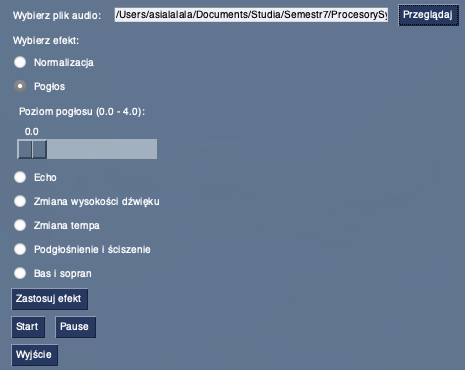
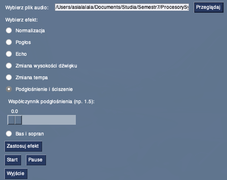

### Opis działania programu do przetwarzania dźwięku

Projekt jest realizacją procesora sygnałowego zaimplementowanego w języku programowym Python. 
Aplikacja umozliwia użytkownikowi wybór efektu i dostosowania parametrów oraz podglądu efektów na pliku dźwiękowym, z możliwością odtwarzania i pauzowania przetworzonego pliku.
Nie jest mozliwe nakładanie efektów na siebie.

Program składa się z trzech plików: `efekty.py`, `gui.py`, i `main.py`. Poniżej znajdziesz instrukcję krok po kroku oraz szczegóły dotyczące działania programu.


---

### Opis działania krok po kroku:
1. **Wybór pliku audio**: Po uruchomieniu `gui.py`, pojawi się okno, w którym możesz wybrać plik audio z komputera.
2. **Wybór efektu**: Wybierz jeden z efektów (normalizacja, pogłos, echo, itp.).
3. **Ustawienie parametrów efektu** (opcjonalnie): Dla niektórych efektów dostępne są dodatkowe parametry, np. poziom pogłosu, opóźnienie echa czy współczynnik pogłośnienia.
4. **Zastosowanie efektu**: Kliknij przycisk „Zastosuj efekt”. Plik audio zostanie przetworzony i zapisany jako `przetworzony_plik_audio.wav` w tym samym folderze, co plik źródłowy.

---

### Diagram przypadków uzycia
Ponizej przedstawiono diagram przypadków uzycia, na ktorym widoczne sa operacje dostepne dla urzytkownika.
W celu edycji diagramu mozna skorzystac z nastepujacego [linku](https://app.diagrams.net/#G1ui_W7STf7rl0ggz2sRm-IsosKM65SGZI#%7B%22pageId%22%3A%22CR_MfkM-ACaT6Vu6J4YW%22%7D),
a następnie pobrać edytowany plik i go podmienić.


---

### Opis słowny architektury planowanego oprogramowania

- Wejścia
  - *Plik audio* z rozszerzeniem .wav, który ma być przetwarzany
  - *Efekt dźwiękowy*, który ma być nałożony na wybrany plik
  - *Parametry efektu*, o ile są wymagane
- Przetwarzanie wewnętrzne 
  - *Moduł GUI* składa się z wyboru pliku audio, wyboru efektu oraz parametrów, a take przycisku odtwarzania i wstrzymywania nagrania.
  - *Moduł przetwarzania audio* umozliwia nałozenie efektu na wgrany plik audio. Wymaga podania sygnału *y* oraz częstotliwości jego próbkowania *sr*. Dostepne sa ponizej wymienione [efekty]
  - *Moduł odtwarzania audio* realizujący odtworzenie, wstrzymanie oraz wznowienie przetworzonego dźwięku.
- Wyjścia
  - *Przetworzony plik audio*, czyli wynik nałozenia efektu na wczytany plik,
  - *Interfejs użytkownika*, informujący o aktualnie wykonywanych działaniach.
- Struktura danych
  - *Tablica NumPy*, która przechowuje sygnał dźwiękowy *y* w postaci próbek.

---

### Opis teoretyczny zaimplementowanych efektów [efekty]

- Normalizacja - normalizuje sygnał audio *y* do zakresu [-1, 1],
- Dodawanie pogłosu - dodaje efekt pogłosu o wskazanym poziomie,
- Dodawanie echa - dodaje efekt echa z wskazanym opóźnieniem i współczynnikiem zaniku,
- Przesunięcie wysokości dźwięku (pitch shift) - zmienia wysokość dźwięku o wskazaną różnicę,
- Zmiana tempa - zwiększa lub zmniejsza tempo dźwięku o wskazany współczynnik bez zmiany częstotliwości dźwięku,
- Pogłośnienie i ściszenie - pogłaśnia lub ścisza dźwięk o wskazany współczynnik,
- Edycja basów i sopranów - umożliwia wzmocnienie basow lub sopranow.

---

### Instrukcja uruchomienia

#### 1. **Zainstaluj wymagane biblioteki**
Program wymaga kilku bibliotek do działania. Możesz je zainstalować, uruchamiając następującą komendę:

```bash
pip install numpy librosa scipy PySimpleGUI soundfile pygame
```

#### 2. **Uruchomienie programu**
Aby uruchomić aplikację z interfejsem graficznym, wykonaj w terminalu następujące polecenie:

```bash
python gui.py
```
---

### Struktura kodu

Program tworzy aplikację do przetwarzania dźwięku z interfejsem graficznym. Składa się z kilku modułów:

  - Plik **`efekty.py`**: Zawiera funkcje implementujące różne efekty audio, takie jak normalizacja, dodawanie pogłosu, echa, zmiana wysokości dźwięku, tempa, podgłośnienie oraz modyfikację basów i sopranów. Wykorzystuje biblioteki takie jak numpy, librosa i scipy do przetwarzania sygnału audio.
  - Plik **`gui.py`**: Służy do wczytywania plików audio, stosowania wybranych efektów z efekty.py oraz zapisywania przetworzonych plików. Używa również biblioteki pygame do odtwarzania dźwięku.
  - Plik **`main.py`**: Zbudowany za pomocą biblioteki PySimpleGUI, umożliwia użytkownikowi wybór pliku audio, efektu do zastosowania oraz regulację parametrów efektu. Pozwala także na odtwarzanie i pauzowanie przetworzonego dźwięku.

Aplikacja integruje te komponenty, umożliwiając interaktywne przetwarzanie i odsłuchiwanie zmodyfikowanych plików audio za pomocą przyjaznego dla użytkownika interfejsu.  

---

### Wykorzystane biblioteki

Program wykorzystuje kilka bibliotek Pythona, które wspólnie umożliwiają przetwarzanie dźwięku, interakcję z użytkownikiem poprzez interfejs graficzny oraz odtwarzanie przetworzonego audio. Oto opis użytych bibliotek:

  - **NumPy**: to podstawowa biblioteka Pythona do obliczeń naukowych. Zapewnia wsparcie dla wielowymiarowych tablic i macierzy oraz bogaty zestaw funkcji matematycznych do operacji na tych strukturach danych. Używana do przetwarzania i manipulacji sygnałami audio reprezentowanymi jako tablice numeryczne. Przykłady zastosowań w programie to normalizacja sygnału czy operacje matematyczne na danych audio.
  - **Librosa**: Librosa to biblioteka przeznaczona do analizy muzyki i dźwięku w Pythonie. Dostarcza narzędzia do ekstrakcji cech dźwiękowych, przetwarzania sygnałów oraz manipulacji dźwiękiem. W programie zostały wykorzystane następujące funkcjonalności: librosa.load pozwala na załadowanie pliku audio do programu, librosa.effects.time_stretch pozwala na przyspieszenie lub spowolnienie odtwarzania bez zmiany wysokości dźwięku, oraz w funkcji bass_soprano używana jest do oddzielenia komponentów basowych i sopranowych sygnału audio.
  - **SciPy Signal**: Moduł signal z biblioteki SciPy dostarcza narzędzia do przetwarzania sygnałów, takie jak filtrowanie, konwolucja czy analiza widmowa. Używany do dodawania efektu pogłosu (reverb). Funkcja signal.fftconvolve pozwala na wykonanie szybkiej konwolucji sygnału audio z jądrem pogłosu, co symuluje efekt przestrzeni akustycznej.
  - **SoundFile**: SoundFile to biblioteka do odczytu i zapisu plików audio, oparta na libsndfile. Obsługuje różne formaty audio i pozwala na łatwe zapisywanie i odczytywanie danych dźwiękowych.
  - **Pygame**: Pygame to zestaw modułów Pythona przeznaczony do tworzenia gier i aplikacji multimedialnych. Oferuje funkcje do obsługi grafiki, dźwięku i interakcji z użytkownikiem.  W szczególności używany jest moduł pygame.mixer do: inicjalizacji systemu audio za pomocą mixer.init(), ładowania i odtwarzania plików dźwiękowych poprzez mixer.Sound, sound_channel.play i kontroli odtwarzania.
  - **PySimpleGUI**:  to biblioteka upraszczająca tworzenie interfejsów graficznych w Pythonie.

---

### Problemy

Problem ze znalezieniem odpowiedniego przykładu, który pokazałby w znaczący sposób działanie filtru normalizacji. Powinna być to próbka o zroznicowanych wartościach.

---

### Użyte metody

#### 1. **efekty.py**

**normalizacja**

```python
def normalize_audio(y, target_min=-0.5, target_max=0.5):
    """Normalizuje sygnał audio do wskazanego zakresu."""
    print("Sygnał pierwotny:")
    print(y)
    sig_min = np.min(y)
    sig_max = np.max(y)
    normalized = (y - sig_min)/(sig_max - sig_min)
    result = normalized * (target_max - target_min) + target_min
    print("Wynik: ")
    print(result)
    return result
```

Funkcja normalize_audio służy do normalizacji sygnału audio y do zadanego zakresu amplitudy określonego przez parametry target_min i target_max. Najpierw oblicza minimalną i maksymalną wartość sygnału, a następnie skaluje wszystkie próbki tak, aby mieściły się w przedziale od 0 do 1. Następnie przekształca znormalizowane wartości do docelowego zakresu poprzez liniowe rozciągnięcie między target_min a target_max. W rezultacie otrzymujemy sygnał o tej samej charakterystyce, ale z amplitudami ograniczonymi do określonego przedziału. Funkcja zwraca znormalizowany sygnał i wypisuje na konsolę wartości przed i po normalizacji.

**pogłos**

```python
def add_reverb(y, sr, reverb_amount=0.5):
    """Dodaje pogłos do sygnału audio."""
    reverb_kernel = np.zeros(int(sr * 0.3))  # 300 ms pogłosu
    reverb_kernel[0] = 1
    reverb_kernel[int(sr * 0.03)] = reverb_amount  # 30 ms opóźnienia
    y_reverb = signal.fftconvolve(y, reverb_kernel, mode='full')
    return y_reverb[:len(y)]
```

Funkcja add_reverb dodaje efekt pogłosu do sygnału audio y. Tworzy ona tablicę reverb_kernel, która reprezentuje jądro pogłosu o długości odpowiadającej 300 ms, z wartością 1 na początku i wartością reverb_amount po 30 ms, symulując opóźnienie odbicia. Następnie przeprowadza konwolucję sygnału y z tym jądrem za pomocą szybkiej transformaty Fouriera (FFT), co dodaje do sygnału efekt pogłosu. Wynikiem jest sygnał audio z dodanym pogłosem, przycięty do długości oryginalnego sygnału. Funkcja zwraca przetworzony sygnał, który brzmi tak, jakby był odtwarzany w pomieszczeniu z naturalnymi odbiciami dźwięku.

**echo**

```python
def add_echo(y, sr, delay=0.2, decay=0.5):
    """Dodaje efekt echa do sygnału audio."""
    delay_samples = int(sr * delay)
    echo_signal = np.zeros(len(y) + delay_samples)
    echo_signal[:len(y)] = y
    echo_signal[delay_samples:] += decay * y
    return echo_signal[:len(y)]
```

Funkcja add_echo dodaje efekt echa do sygnału audio y. Oblicza liczbę próbek odpowiadającą zadanemu opóźnieniu delay (domyślnie 0.2 sekundy) przez mnożenie częstotliwości próbkowania sr przez wartość opóźnienia. Następnie tworzy nową tablicę echo_signal, która jest rozszerzona o liczbę próbek opóźnienia, aby pomieścić echo. Kopiuje oryginalny sygnał do echo_signal i dodaje do niego opóźnioną kopię sygnału y, pomnożoną przez współczynnik zaniku decay (domyślnie 0.5), co symuluje stopniowe zanikanie echa. Na koniec zwraca sygnał z dodanym echem, przycięty do długości oryginalnego sygnału.

**zmiana wysokości dźwięku**

```python
def pitch_shift(y, sr, n_steps):
    """Zmienia wysokość dźwięku o podaną liczbę półtonów."""
    return librosa.effects.pitch_shift(y, sr=sr, n_steps=n_steps)
```

Funkcja pitch_shift zmienia wysokość dźwięku sygnału audio y o określoną liczbę półtonów n_steps. Wykorzystuje metodę librosa.effects.pitch_shift do przetworzenia sygnału, zachowując oryginalny czas trwania audio. Parametr sr oznacza częstotliwość próbkowania sygnału i jest niezbędny dla poprawnego działania algorytmu. Poprzez modyfikację wartości n_steps, funkcja może podwyższyć lub obniżyć tonację dźwięku, efektywnie transponując go w górę lub w dół. Wynikiem jest przetworzony sygnał audio z nową wysokością dźwięku.

**zmiana tempa**

```python
def change_tempo(y, rate):
    """Zmienia tempo odtwarzania sygnału audio."""
    return librosa.effects.time_stretch(y, rate=rate)
```

Funkcja change_tempo zmienia tempo odtwarzania sygnału audio y o zadany współczynnik rate. Wykorzystuje metodę librosa.effects.time_stretch z biblioteki Librosa, która pozwala na zmianę tempa bez wpływu na wysokość dźwięku (tonację). Parametr rate określa proporcję zmiany tempa; wartość większa niż 1 przyspiesza odtwarzanie, a mniejsza niż 1 je spowalnia. Funkcja zwraca przetworzony sygnał audio z nowym tempem odtwarzania. Dzięki temu można dostosować prędkość utworu, zachowując jego oryginalną tonację i barwę.

**zmiana głośności**

```python
def amplify(y, factor):
    """Zmienia głośność sygnału audio przez mnożenie amplitudy przez factor."""
    return y * factor
```

Funkcja amplify zmienia głośność sygnału audio y poprzez mnożenie jego amplitudy przez zadany współczynnik factor. Jeżeli factor jest większy niż 1, sygnał zostanie podgłośniony; jeżeli jest mniejszy niż 1, sygnał zostanie przyciszony. Funkcja zwraca przetworzony sygnał z nowym poziomem głośności. Jest to bezpośrednia i efektywna metoda skalowania amplitudy sygnału bez wpływu na jego inne właściwości. Dzięki temu można łatwo dostosować głośność utworu do pożądanego poziomu odsłuchu.

**zmiana basu i sopranu**

```python
def bass_soprano(y, sr,  bass_factor=1, soprano_factor=1):
    """Podgłaśnia basy mnoąc przez bass_factor i soprany mnozac przez soprano_factor. 
    Oparte na implementacji https://librosa.org/doc/main/auto_examples/plot_vocal_separation.html """
    S_full, phase = librosa.magphase(librosa.stft(y))
    # Tworzenie filtru, ktory podzieli dzwiek na ten z czestotliwoscia ponizej i powyzej
    # mediany czestotliwosci wystepujacych w calym nagraniu
    S_filter = librosa.decompose.nn_filter(S_full,
                                       aggregate=np.mean,
                                       metric='cosine',
                                       width=int(librosa.time_to_frames(2, sr=sr)))
    S_filter = np.minimum(S_full, S_filter)
    
    margin_i, margin_v = 2, 10
    power = 2

    # Naloz maske aby podzielic nagranie na sopran i bas
    
    mask_i = librosa.util.softmask(S_filter,
                               margin_i * (S_full - S_filter),
                               power=power)

    mask_v = librosa.util.softmask(S_full - S_filter,
                               margin_v * S_filter,
                               power=power)

    S_soprano = mask_v * S_full
    S_bass = mask_i * S_full

    y_soprano = librosa.istft(S_soprano * phase)
    y_bass = librosa.istft(S_bass * phase)

    y_soprano = y_soprano * soprano_factor
    y_bass = y_bass * bass_factor

    y_processed = y_soprano + y_bass 
    return y_processed
```

Funkcja bass_soprano umożliwia niezależne podgłaśnianie lub przyciszanie niskich (bas) i wysokich (sopran) częstotliwości w sygnale audio y. Wykorzystuje bibliotekę Librosa do przekształcenia sygnału w dziedzinę częstotliwości za pomocą transformaty STFT i oddzielenia fazy od amplitudy. Następnie tworzy maski częstotliwościowe, które pozwalają podzielić sygnał na komponenty basowe i sopranowe. Po zastosowaniu odpowiednich współczynników bass_factor i soprano_factor, skalowane sygnały są przekształcane z powrotem do dziedziny czasu i sumowane, aby uzyskać końcowy przetworzony sygnał. Funkcja zwraca sygnał audio z indywidualnie dostosowanymi poziomami basów i sopranów.

#### 2. **main.py**

**wybór efektu**

```python
def apply_effect(file_path, effect_name, *args):
    # Wczytaj plik audio
    y, sr = librosa.load(file_path, sr=None)

    # Zastosowanie wybranego efektu
    if effect_name == 'normalize':
        y_processed = normalize_audio(y, *args)
    elif effect_name == 'reverb':
        y_processed = add_reverb(y, sr, *args)
    elif effect_name == 'echo':
        y_processed = add_echo(y, sr, *args)
    elif effect_name == 'pitch_shift':
        y_processed = pitch_shift(y, sr, *args)
    elif effect_name == 'tempo_change':
        y_processed = change_tempo(y, *args)
    elif effect_name == 'amplify':
        y_processed = amplify(y, *args)
    elif effect_name == 'attenuate':
        y_processed = amplify(y, *args)
    elif effect_name == 'bass_soprano':
        y_processed = bass_soprano(y, sr, *args)
    else:
        print("Nieznany efekt.")
        return

    # Zapis przetworzonego pliku
    output_path = 'przetworzony_plik_audio.wav'
    sf.write(output_path, y_processed, sr)
    print(f"Efekt został zastosowany i zapisany w '{output_path}'.")
```

Funkcja apply_effect służy do zastosowania wybranego efektu dźwiękowego do pliku audio wskazanego przez file_path. Najpierw wczytuje plik audio za pomocą librosa.load, otrzymując sygnał audio y oraz częstotliwość próbkowania sr. Następnie, na podstawie podanej nazwy efektu effect_name, wywołuje odpowiednią funkcję przetwarzającą sygnał, taką jak normalize_audio, add_reverb, add_echo i inne, przekazując do niej sygnał y oraz ewentualne dodatkowe argumenty *args. Jeśli nazwa efektu nie jest rozpoznana, funkcja informuje o tym i kończy działanie. Po przetworzeniu sygnału, zapisuje zmodyfikowany dźwięk do pliku przetworzony_plik_audio.wav za pomocą soundfile.write i wyświetla komunikat potwierdzający pomyślne zastosowanie efektu oraz zapisanie pliku.

**odtworzenie dźwięku**

```python
def start(sound_path):
    global is_playing
    global sound
    global sound_channel
    is_playing = True
    sound = mixer.Sound(sound_path)
    sound_channel.play(sound)
```

Funkcja start(sound_path) inicjuje odtwarzanie pliku audio wskazanego przez argument sound_path. Na początku deklaruje zmienne globalne: is_playing, sound oraz sound_channel, aby umożliwić dostęp do nich w całym programie. Ustawia zmienną is_playing na True, co sygnalizuje, że odtwarzanie dźwięku jest aktywne. Następnie tworzy obiekt sound za pomocą metody mixer.Sound(sound_path), która wczytuje plik audio do pamięci. Na koniec wywołuje sound_channel.play(sound), co rozpoczyna odtwarzanie dźwięku na określonym kanale miksowania dźwięku. Funkcja ta umożliwia rozpoczęcie odtwarzania przetworzonego pliku audio w aplikacji, korzystając z biblioteki pygame.mixer do zarządzania dźwiękiem.

**funkcja pauzy**

```python
def pause():
    global is_playing
    global sound_channel
    global sound
    if  is_playing :
        is_playing = False
        sound_channel.pause()
    else :
        sound_channel.unpause()
        is_playing = True
```

Funkcja pause działa analogicznie jak funkcja start. Jeśli dźwięk jest odtwarzany, funkcja go wstrzymuje i aktualizuje stan na False. Jeśli dźwięk jest wstrzymany, funkcja wznawia odtwarzanie i aktualizuje stan na True.

#### 3. **gui.py**

**tworzenie okna**

```python
def create_window():
    layout = [
        [sg.Text('Wybierz plik audio:'), sg.Input(), sg.FileBrowse(key='file', button_text="Przeglądaj")],
        [sg.Text('Wybierz efekt:')],
        # ... (elementy interfejsu dla różnych efektów) ...
        [sg.Button('Zastosuj efekt')],
        [sg.Button('Start'), sg.Button('Pause')],
        [sg.Button('Wyjście')]
    ]
    return sg.Window('Procesor Dźwięku', layout, finalize=True)
```

Funkcja create_window() tworzy okno aplikacji graficznego interfejsu użytkownika (GUI) dla procesora dźwięku za pomocą biblioteki PySimpleGUI. Wewnątrz funkcji definiowany jest układ (layout), który określa rozmieszczenie i wygląd elementów interfejsu użytkownika. Funkcja zwraca gotowe do użycia okno aplikacji, które po uruchomieniu pozwala użytkownikowi na interaktywne przetwarzanie plików audio z wykorzystaniem różnych efektów dźwiękowych i dostosowywanie ich parametrów w przyjaznym interfejsie graficznym.

**aktualizacja wyglądu okna**

```python
def update_visibility(values, window):
    # Hide all parameter controls
    for key in ['normalize_params', 'reverb_params', 'echo_params', 'pitch_shift_params', 'tempo_change_params', 'amplify_params', 'bass_soprano_params']:
        window[key].update(visible=False)

    # Show parameter controls for the selected effect
    if values['reverb']:
        window['reverb_params'].update(visible=True)
    elif values['normalize']:
        window['normalize_params'].update(visible=True)
    elif values['echo']:
        window['echo_params'].update(visible=True)
    elif values['pitch_shift']:
        window['pitch_shift_params'].update(visible=True)
    elif values['tempo_change']:
        window['tempo_change_params'].update(visible=True)
    elif values['amplify']:
        window['amplify_params'].update(visible=True)
    elif values['bass_soprano']:
        window['bass_soprano_params'].update(visible=True)
```

Funkcja update_visibility(values, window) zarządza widocznością paneli z parametrami efektów w interfejsie graficznym aplikacji, dostosowując je do aktualnie wybranego przez użytkownika efektu dźwiękowego. Na początku funkcja ukrywa wszystkie panele parametrów, iterując przez listę kluczy odpowiadających poszczególnym efektom (takich jak 'normalize_params', 'reverb_params', 'echo_params' itd.) i ustawiając ich widoczność na False za pomocą metody window[key].update(visible=False). Następnie sprawdza, który efekt został wybrany przez użytkownika, analizując słownik values, który zawiera aktualne stany wszystkich elementów interfejsu.

---

### Zrzuty z działania programu

Domyślny interfejs użytkownika:


Błąd o braku wczytania pliku audio:


Wybór parametrów normalizacji:


Wybór parametrów pogłosu:



Wybór parametrów echa:


Wybór parametrów zmiany wysokości dźwięku:


Wybór parametrów zmiany tempa dźwięku:


Wybór parametrów pogłośnienia i ściszenia:



Wybór parametrów dostosowania głośności basów i sopranów:


Informacja o przetworzeniu:


